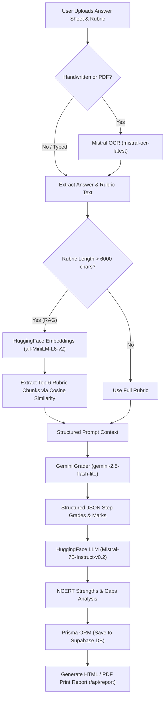

# PrepForge: AI-Powered Faculty Evaluation Suite

An automated grading platform designed specifically for JEE & NEET descriptive exams and OMR sheets.

---

## 🎯 The Big Picture (Founder Pitch)

Manually checking descriptive papers (JEE/NEET), applying correct marking rubrics, and scanning OMR sheets for anomalies is an extremely time-consuming and inconsistent process for faculty. PrepForge makes this entire workflow **90% faster** and fully digital. 

The platform transcribes handwritten answers & PDFs, matches them semantically against institutional rubrics, grades them with structured evaluations and evidence citations using the best model capabilities from Gemini, generates NCERT-aligned gap analyses, and builds downloadable offline reports.

---

## 🏗️ System Architecture & Workflow

Here is how PrepForge processes an evaluation request:



---

## 🧠 1. How and Where AI is Used (Multi-API Stack)

PrepForge integrates several AI models to balance performance, cost, and reliability:

### Multimodal Vision OCR (Mistral OCR)
- **Model**: `mistral-ocr-latest`
- **Use Case**: Faculty can upload handwritten answer copies or question booklets as images (JPEG, PNG, WEBP) or multi-page PDFs. The system transcribes them to markdown format, preserving formulas and mathematical expressions.
- **Location**: Handles transcription inside [ocrAnswerSheets](file:///c:/Users/DELL/PrepForge/app/lib/ai-grading.ts#L174-L192) via [mistralOCR.ts](file:///c:/Users/DELL/PrepForge/app/lib/mistralOCR.ts).

### Semantic RAG (HuggingFace Embeddings)
- **Model**: `sentence-transformers/all-MiniLM-L6-v2` via the HuggingFace Inference API (`router.huggingface.co`).
- **Use Case**: When rubrics are large, they are chunked. We compute semantic similarity between the student's answer and the rubric chunks, picking the top-6 relevant chunks to include in the grading prompt.
- **Location**: Managed in [hfEmbeddings.ts](file:///c:/Users/DELL/PrepForge/app/lib/hfEmbeddings.ts) and integrated in `retrieveRubricContext` inside [ai-grading.ts](file:///c:/Users/DELL/PrepForge/app/lib/ai-grading.ts#L155-L172).

### Strict Structured JSON Evaluation (Gemini)
- **Model**: `gemini-2.5-flash-lite` (using `responseMimeType: "application/json"`)
- **Use Case**: Performs step-by-step descriptive grading and reads OMR bubble sheets.
- **Location**: Configured in [gemini.ts](file:///c:/Users/DELL/PrepForge/app/lib/gemini.ts) and executed in [ai-grading.ts](file:///c:/Users/DELL/PrepForge/app/lib/ai-grading.ts).

### NCERT Strengths & Gaps Analysis (HuggingFace LLM)
- **Model**: `mistralai/Mistral-7B-Instruct-v0.2` via HuggingFace Inference API (`router.huggingface.co`).
- **Use Case**: Provides personalized revision advice, weak areas with exact NCERT chapter names, and a revision plan with PYQ count.
- **Location**: Handled in [hfAnalysis.ts](file:///c:/Users/DELL/PrepForge/app/lib/hfAnalysis.ts) and triggered in [evaluate/route.ts](file:///c:/Users/DELL/PrepForge/app/api/evaluate/route.ts#L118-L123).

---

## 🛡️ Fail-Safe & Robust Design

To ensure uninterrupted faculty usage, PrepForge implements a multi-tier fallback architecture:

> [!IMPORTANT]
> **API Key Resiliency**
> - **HuggingFace Failure**: If the `HF_TOKEN` in `.env` is missing, invalid (e.g. 401 Unauthorized), or blocked by your network/DNS, the application **does not crash**. 
> - **Embeddings Fallback**: If the HuggingFace embeddings API fails, the system automatically falls back to raw local keyword/chunk mapping.
> - **Analysis Fallback**: If the HuggingFace analysis API fails, the system bypasses it gracefully and tags a `"please review manually"` or token error message, allowing grading and saving to finish successfully.
> - **No-AI Local Mode**: If both Gemini and Mistral keys are missing, the platform shifts to a fully local keyword-matching regex evaluator.

---

## 🛠️ 2. Key Platform Features

### Dual Evaluation Console
- **Descriptive Console**: Grades handwritten subjective copies against marking rubrics.
- **OMR Console**: Detects bubbles, warns of anomalies (double bubbles, faint marks), and calculates standard JEE/NEET negative markings (`+4` / `-1`).

### Citations and Evidence Tracking
For every step evaluated, the grader attaches the student's exact quote from their scanned answer. This gives students and parents concrete, proof-based grading feedback.

### Live Dashboard & Evaluation History
A responsive, glassmorphic dark-mode console where all historical evaluation results are stored. Records can be loaded back into the active view, verified, or deleted.

### Downloadable Print Reports
Generate parent-friendly, print-to-PDF optimized HTML evaluation cards at the click of a button, supported by server-side templates.

---

## 🗂️ Integrations File Map

| File Path | Description |
|---|---|
| 🆕 [mistralOCR.ts](file:///c:/Users/DELL/PrepForge/app/lib/mistralOCR.ts) | SDK Client wrapper that handles image & PDF OCR processing using `mistral-ocr-latest`. |
| 🆕 [hfEmbeddings.ts](file:///c:/Users/DELL/PrepForge/app/lib/hfEmbeddings.ts) | Embedding utility generating vector representation of answers and chunking rubrics for Cosine Similarity calculations. |
| 🆕 [hfAnalysis.ts](file:///c:/Users/DELL/PrepForge/app/lib/hfAnalysis.ts) | Summarization tool calling `Mistral-7B-Instruct` for NCERT chapter analysis. |
| 🆕 [reportGenerator.ts](file:///c:/Users/DELL/PrepForge/app/lib/reportGenerator.ts) | Formats student metrics, strengths, weaknesses, and citations into an elegant printable HTML layout. |
| 🆕 [report/route.ts](file:///c:/Users/DELL/PrepForge/app/api/report/route.ts) | Express POST route that serves the generated HTML report for client/browser printing. |
| 🔄 [ai-grading.ts](file:///c:/Users/DELL/PrepForge/app/lib/ai-grading.ts) | Main orchestrator rewritten to use Mistral OCR and HuggingFace semantic context embedding retrieval. |
| 🔄 [evaluate/route.ts](file:///c:/Users/DELL/PrepForge/app/api/evaluate/route.ts) | Wire-up of evaluate pipeline: Mistral OCR ➡️ HF Embeddings RAG ➡️ Gemini Grading ➡️ HF NCERT analysis. |
| 🔄 [ocr/route.ts](file:///c:/Users/DELL/PrepForge/app/api/ocr/route.ts) | Integrated Mistral OCR for general scanning, retaining Gemini only for bubble-coordinate OMR parsing. |

---

## 🚀 Getting Started

### Prerequisites
- Node.js 18+
- PostgreSQL (or use SQLite/local mode)
- API Keys: Google Gemini key, Mistral AI key, HuggingFace token.

### Installation

```bash
# Clone the repository
git clone https://github.com/your-username/PrepForge.git
cd PrepForge

# Install dependencies
npm install

# Set up environment variables
cp .env.example .env
```

Open `.env` and fill in the required API keys:
```env
GEMINI_API_KEY=your_gemini_key
GEMINI_MODEL=gemini-2.5-flash-lite

MISTRAL_API_KEY=your_mistral_key
HF_TOKEN=your_huggingface_token
```

### Starting the Server
```bash
# Run database migrations
npx prisma migrate dev

# Start Next.js dev server
npm run dev
```

On Windows, you can also run:
- `setup.bat`: For first-time setups and dependency installations.
- `dev.bat`: Launches the Next.js local server directly.

---

## 📄 License
This project is proprietary. All rights reserved.


## 📄 License

This project is proprietary. All rights reserved.

---
