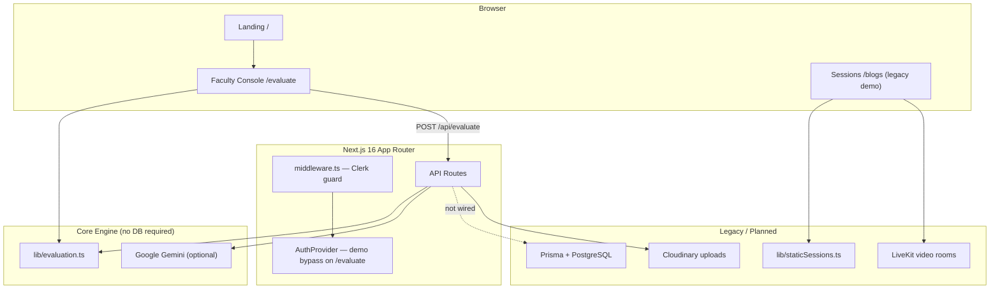
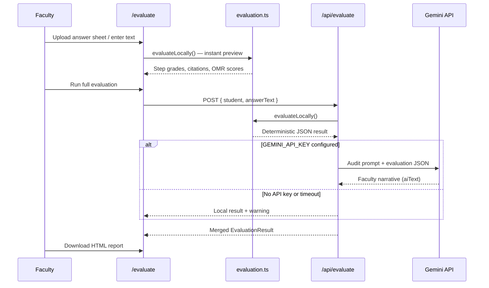
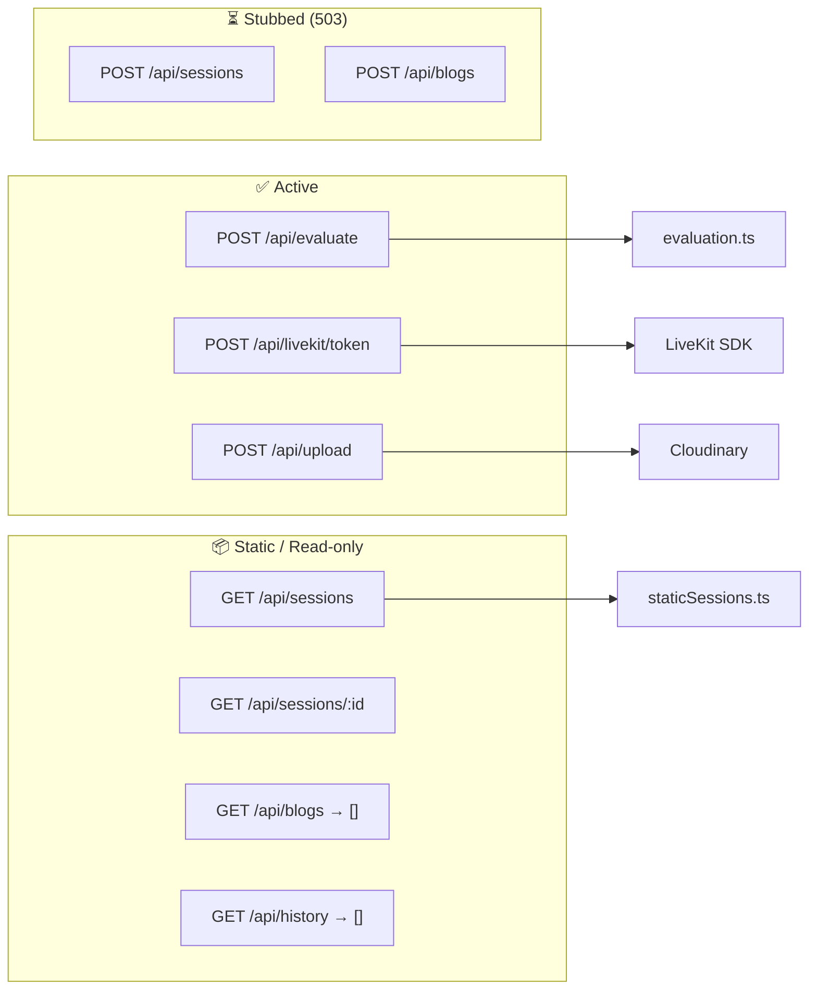
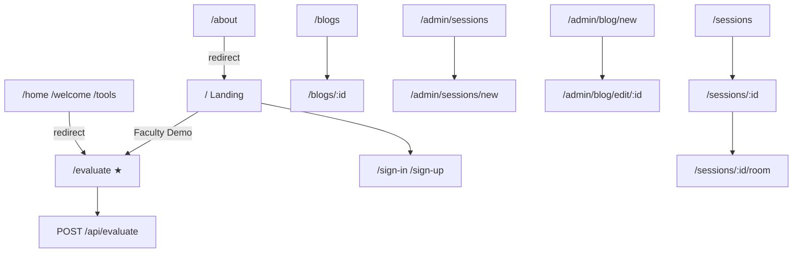
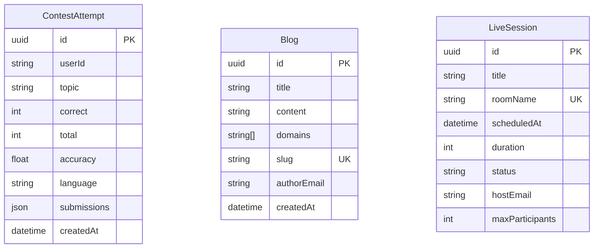

# PrepForge — Faculty AI Evaluation Suite for JEE & NEET

> Production-oriented AI grading for step-wise descriptive answers, OMR verification, and faculty audit reports — built on Next.js 16 with optional Gemini narration.

PrepForge helps faculty evaluate **JEE and NEET** answer sheets without relying on a live database for the core demo. Rubric-constrained local grading runs first; Google Gemini optionally adds a faculty audit narrative on top of deterministic JSON output.

---

## Table of Contents

- [Quick Start](#quick-start)
- [System Architecture](#system-architecture)
- [Evaluation Pipeline](#evaluation-pipeline)
- [Project Structure](#project-structure)
- [File Reference](#file-reference)
- [API Routes](#api-routes)
- [Pages & Routes](#pages--routes)
- [Database Schema](#database-schema)
- [Environment Variables](#environment-variables)
- [Feature Status](#feature-status)

---

## Quick Start

```bash
git clone https://github.com/DevSars24/PrepForge.git
cd PrepForge
npm install
```

Create a `.env` file (see [Environment Variables](#environment-variables)):

```env
GEMINI_API_KEY=your_gemini_api_key
NEXT_PUBLIC_CLERK_PUBLISHABLE_KEY=pk_test_...
CLERK_SECRET_KEY=sk_test_...
```

```bash
npm run dev
```

Open [http://localhost:3000](http://localhost:3000) for the landing page, or go directly to [http://localhost:3000/evaluate](http://localhost:3000/evaluate) for the Faculty Console.

---

## System Architecture



### Tech Stack

| Layer | Technology |
|-------|------------|
| Framework | Next.js 16 (App Router) + TypeScript + React 19 |
| Styling | Tailwind CSS 4, shadcn/ui primitives |
| Auth | Clerk (`@clerk/nextjs`) |
| AI | Google Gemini 1.5 Flash (`temperature: 0`) |
| Database (planned) | PostgreSQL + Prisma ORM |
| Video (demo) | LiveKit |
| Media | Cloudinary |

---

## Evaluation Pipeline

How a student answer moves from upload to graded report:



### Grading Logic Highlights

1. **Step-wise descriptive grading** — Rubric points decomposed into keywords; BM25-style lexical matching awards full, partial, or review marks per step.
2. **Citation badges** — Every awarded mark links to a rubric source excerpt (`[Source: Page X, Line Y]`).
3. **OMR verification** — JEE/NEET marking scheme (+4 correct, −1 wrong); double-bubble and light-mark anomalies flagged.
4. **Gap analysis** — Weak topics mapped to NCERT practice recommendations.
5. **RAG guardrails** — Gemini receives only the local evaluation JSON; it narrates, it does not invent marks.

---

## Project Structure

```
PrepForge/
├── app/                    # Next.js App Router (pages, API, components, libs)
│   ├── api/                # REST endpoints
│   ├── components/         # React UI components
│   ├── lib/                # Domain logic & utilities
│   ├── admin/              # Admin-only pages (sessions, blogs)
│   ├── blogs/              # Blog listing & detail pages
│   ├── evaluate/           # ★ Faculty Console (main product)
│   ├── sessions/           # Live mentor session pages
│   └── ...                 # Auth, landing, redirects
├── prisma/                 # Database schema (PostgreSQL)
├── public/                 # Static assets
├── middleware.ts           # Clerk route protection
├── next.config.ts          # Next.js configuration
├── components.json         # shadcn/ui config
└── package.json            # Dependencies & scripts
```

---

## File Reference

### Root Configuration

| File | Purpose |
|------|---------|
| `package.json` | Project dependencies, scripts (`dev`, `build`, `start`, `lint`) |
| `tsconfig.json` | TypeScript config; path alias `@/*` → `app/*` |
| `next.config.ts` | Externalizes Prisma, Cloudinary image host, tracing root |
| `next-env.d.ts` | Auto-generated Next.js type references |
| `eslint.config.mjs` | ESLint rules (Next.js preset) |
| `postcss.config.mjs` | PostCSS + Tailwind pipeline |
| `components.json` | shadcn/ui component generator settings |
| `middleware.ts` | Clerk middleware; public routes include `/`, `/evaluate`, auth pages, evaluation APIs |
| `.env.example` | Template for required environment variables |
| `.gitignore` | Ignores `node_modules`, `.env`, build output, `dev.db` |
| `types.d.ts` | Ambient types for `react-syntax-highlighter` |
| `react-select.d.ts` | Loose typings for `react-select` |
| `react-markdown.d.ts` | Loose typings for `react-markdown` |
| `monaco-editor-react.d.ts` | Loose typings for Monaco editor wrapper |

### `app/` — Application Root

| File | Purpose |
|------|---------|
| `app/layout.tsx` | Root HTML shell, dark theme, metadata, wraps all pages in `AuthProvider` |
| `app/globals.css` | Global Tailwind styles and CSS design tokens |
| `app/page.tsx` | Marketing landing page — product overview, CTA to Faculty Console |

### `app/lib/` — Core Logic

| File | Purpose |
|------|---------|
| `app/lib/evaluation.ts` | **Core domain engine** — student/rubric data, `evaluateLocally()`, OMR grading, rankings, report HTML builder, all `EvaluationResult` types |
| `app/lib/staticSessions.ts` | Hardcoded mentor session data (replaces DB until Prisma is connected) |
| `app/lib/prisma.ts` | Prisma client singleton (prepared for PostgreSQL; not yet imported by routes) |
| `app/lib/utils.ts` | `cn()` helper — merges Tailwind class names |

### `app/components/` — UI Components

| File | Purpose |
|------|---------|
| `AuthProvider.tsx` | Wraps app in `ClerkProvider` except on `/evaluate` (open demo mode) |
| `Navbar.tsx` | Top navigation for landing, sessions, and blogs |
| `VideoRoom.tsx` | LiveKit video room wrapper for live mentor sessions |
| `JoinSessionButton.tsx` | Fetches LiveKit token and navigates to session room |
| `BlogSearch.tsx` | Debounced search input for blog listing |
| `ui/button.tsx` | shadcn Button primitive (used across sessions, blogs, admin) |

### `app/api/` — API Routes

| File | Purpose |
|------|---------|
| `api/evaluate/route.ts` | **Primary API** — runs local grading, optionally calls Gemini for audit text |
| `api/gemini/route.ts` | Generic Gemini prompt endpoint (marks/feedback modes) |
| `api/blogs/route.ts` | GET returns `[]`; POST returns 503 (DB not connected) |
| `api/blogs/[id]/route.ts` | GET → 404; PUT/DELETE → 503 |
| `api/sessions/route.ts` | GET returns filtered `STATIC_SESSIONS`; POST → 503 |
| `api/sessions/[id]/route.ts` | GET static session by ID; PUT/DELETE → 503 |
| `api/history/route.ts` | Clerk-authenticated contest history (returns `[]` placeholder) |
| `api/upload/route.ts` | Admin-only Cloudinary image upload for blog editor |
| `api/livekit/token/route.ts` | Issues LiveKit JWT for authenticated users joining a room |

### `app/evaluate/` — Faculty Console (Main Product)

| File | Purpose |
|------|---------|
| `app/evaluate/page.tsx` | Full faculty workspace — descriptive grading, OMR checker, rank analysis, HTML report export |

### `app/sessions/` — Live Mentor Sessions

| File | Purpose |
|------|---------|
| `app/sessions/page.tsx` | Lists scheduled/live mentor sessions from static data |
| `app/sessions/[id]/page.tsx` | Session detail with join button |
| `app/sessions/[id]/room/page.tsx` | LiveKit video room (only when session status is `live`) |

### `app/blogs/` — Faculty Blog

| File | Purpose |
|------|---------|
| `app/blogs/page.tsx` | Blog grid (empty until DB connected) |
| `app/blogs/[id]/page.tsx` | Blog detail (returns 404 until DB connected) |

### `app/admin/` — Admin Pages

| File | Purpose |
|------|---------|
| `app/admin/sessions/page.tsx` | Admin session management list |
| `app/admin/sessions/new/page.tsx` | Create new session form (POST → 503 until DB) |
| `app/admin/blog/new/page.tsx` | Monaco markdown editor + Cloudinary image upload |
| `app/admin/blog/edit/[id]/page.tsx` | Edit existing blog post |

### Auth & Redirect Pages

| File | Purpose |
|------|---------|
| `app/sign-in/page.tsx` | Clerk sign-in → redirects to `/evaluate` |
| `app/sign-up/page.tsx` | Clerk sign-up → redirects to `/evaluate` |
| `app/home/page.tsx` | Redirect → `/evaluate` |
| `app/welcome/page.tsx` | Redirect → `/evaluate` |
| `app/tools/page.tsx` | Redirect → `/evaluate` |
| `app/about/page.tsx` | Redirect → `/` |

### `prisma/` — Database

| File | Purpose |
|------|---------|
| `prisma/schema.prisma` | PostgreSQL models: `ContestAttempt`, `Blog`, `LiveSession` |

### `public/` — Static Assets

| File | Purpose |
|------|---------|
| `public/vercel.svg` | Vercel logo asset |
| `public/file.svg` | Generic file icon |
| `public/window.svg` | Window icon asset |

---

## API Routes



| Method | Route | Status | Description |
|--------|-------|--------|-------------|
| `POST` | `/api/evaluate` | Active | Local grading + optional Gemini audit |
| `POST` | `/api/gemini` | Active | Generic Gemini prompt |
| `GET` | `/api/sessions` | Static | Returns hardcoded mentor sessions |
| `GET` | `/api/sessions/[id]` | Static | Single session by ID |
| `POST` | `/api/sessions` | Stub | 503 — DB not connected |
| `GET` | `/api/blogs` | Empty | Returns `[]` |
| `POST` | `/api/blogs` | Stub | 503 — DB not connected |
| `GET` | `/api/history` | Placeholder | Auth required, returns `[]` |
| `POST` | `/api/upload` | Active | Admin Cloudinary upload |
| `POST` | `/api/livekit/token` | Active | LiveKit room JWT |

---

## Pages & Routes



| Route | Access | Description |
|-------|--------|-------------|
| `/` | Public | Marketing landing page |
| `/evaluate` | Public (demo) | Faculty Console — main product |
| `/sign-in`, `/sign-up` | Public | Clerk authentication |
| `/sessions` | Auth (if Clerk configured) | Mentor session listing |
| `/sessions/[id]/room` | Auth | LiveKit video room |
| `/blogs` | Auth | Blog listing (empty) |
| `/admin/*` | Admin email gate | Session & blog management |

---

## Database Schema



> **Note:** Prisma schema targets **PostgreSQL** (`DATABASE_URL` + `DIRECT_URL`). The core evaluation demo runs entirely without a database.

---

## Environment Variables

| Variable | Required | Used By |
|----------|----------|---------|
| `GEMINI_API_KEY` | Optional | `/api/evaluate`, `/api/gemini` — falls back to local grading |
| `NEXT_PUBLIC_CLERK_PUBLISHABLE_KEY` | Optional | Clerk auth (skipped on `/evaluate`) |
| `CLERK_SECRET_KEY` | Optional | Clerk server-side auth |
| `DATABASE_URL` | For DB features | Prisma / PostgreSQL |
| `DIRECT_URL` | For DB features | Prisma migrations (Supabase) |
| `CLOUDINARY_CLOUD_NAME` | For uploads | `/api/upload` |
| `CLOUDINARY_API_KEY` | For uploads | `/api/upload` |
| `CLOUDINARY_API_SECRET` | For uploads | `/api/upload` |
| `LIVEKIT_API_KEY` | For video | `/api/livekit/token` |
| `LIVEKIT_API_SECRET` | For video | `/api/livekit/token` |
| `LIVEKIT_URL` | For video | `VideoRoom` component |

Copy `.env.example` and fill in the keys you need. The Faculty Console works with zero configuration.

---

## Feature Status

| Feature | Status | Notes |
|---------|--------|-------|
| Landing page | ✅ Active | Marketing + CTA |
| Faculty Console (`/evaluate`) | ✅ Active | Local grading, OMR, HTML reports |
| Gemini audit narration | ✅ Active | Requires `GEMINI_API_KEY` |
| Clerk authentication | ✅ Active | Bypassed on `/evaluate` for demo |
| Live mentor sessions | 📦 Static demo | Hardcoded data in `staticSessions.ts` |
| LiveKit video rooms | ⚙️ Needs env | Token API ready; needs LiveKit keys |
| Blog system | ⏳ Stubbed | UI exists; DB not connected |
| Contest history | ⏳ Stubbed | API returns empty array |
| Prisma / PostgreSQL | ⏳ Planned | Schema ready, not wired to routes |

---

## Scripts

```bash
npm run dev      # Start development server (webpack)
npm run build    # Production build
npm run start    # Start production server
npm run lint     # Run ESLint
npx prisma db push   # Sync schema to PostgreSQL (when DB is configured)
```

---

## License

MIT — see repository for details.
