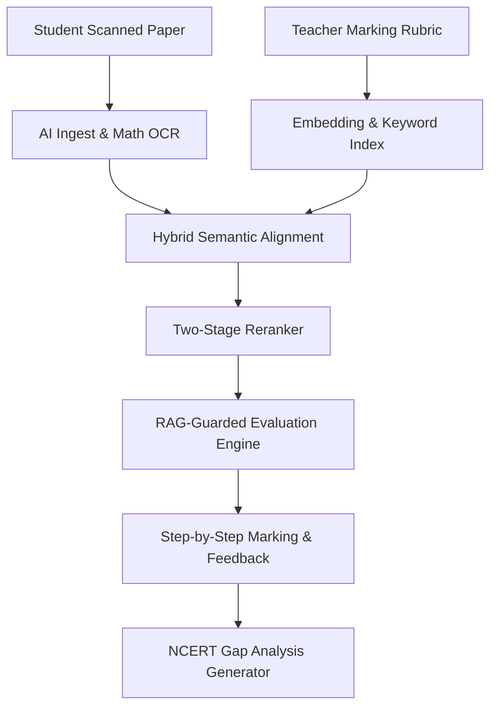

# 🎓 PrepForge: Tailored AI Evaluation Suite for JEE & NEET
> **Production-grade AI integration optimized for step-wise descriptive grading and OMR verification.**

PrepForge is a specialized evaluation platform designed for faculty to grade **JEE and NEET** student answers. Instead of using generic LLM prompts that guess grades, PrepForge implements a custom, **rubric-constrained Retrieval-Augmented Generation (RAG)** pipeline to analyze handwritten answers step-by-step, verify OMR bubble sheets, and trace student learning gaps.

---

## 🧠 How AI is Best Implemented in PrepForge

Applying AI to high-stakes exams like JEE (Joint Entrance Exam) and NEET (National Eligibility cum Entrance Test) requires extreme precision. A general-purpose AI chat model will fail or hallucinate. Here is how we implement AI correctly for academic evaluation:



### 1. Step-Wise Mathematical Derivation Checking (Descriptive)
* **The Problem:** JEE Physics and Mathematics questions are graded on step-marking. A student might write the correct formula, make a minor calculation mistake, but still deserve $70\%$ of the marks. Standard AI models only check the final output.
* **Our Implementation:** We feed the AI the OCR-transcribed student answer and guide it through a step-by-step alignment. The AI decomposes the marking rubric into a checklist of intermediate equations and verifies if the student successfully derived each step. It awards fractional marks based on structural progress.

### 2. Hybrid Retrieval for Academic Terminology
* **The Problem:** NEET Biology requires exact nomenclature (e.g., *Aromatic substitution*, *NCERT plant kingdom taxonomy*). Semantic vector databases alone might confuse closely related biology concepts, whereas simple keyword searches miss paraphrased student answers.
* **Our Implementation:** We run a dual-retrieval system:
  - **BM25 (Keyword Search):** Matches exact formulas, scientific names, and question numbers.
  - **Vector Search (Semantic):** Captures conceptual understanding when a student explains a concept in their own words.
  - **Reciprocal Rank Fusion:** Melds the two searches together to grab the exact matching grading criteria.

### 3. RAG-Guarded Guardrails (Zero Hallucination)
* **The Problem:** LLMs are prone to hallucinating facts or applying grading criteria that were not in the teacher's rubric, leading to unfair grading.
* **Our Implementation:** The AI is locked into a **RAG-guided sandbox**. It is strictly prohibited from using its pre-trained knowledge to judge the correctness of an answer. It acts as a logical prover: *Is Statement A (Student Answer) logically equivalent to Statement B (Model Answer) under the constraints of Rubric C?* If the answer key does not support a grade, the AI flags it for manual faculty review.

### 4. Clickable Source Citation Badges
* **Our Implementation:** Every mark and deduction generated by the AI is tagged with a citation badge (e.g., `[Source 1: Page 2, Line 15]`). This links the student's paper and the teacher's rubric directly to the grade. Faculty can click any grade to audit exactly which rubric point was used to score that step.

### 5. Automated NCERT Topic Gap Analysis
* **Our Implementation:** After grading, the AI matches student errors against standard JEE/NEET syllabus nodes (e.g., *Ray Optics*, *Chemical Kinetics*). It generates a targeted learning gap dashboard that identifies specific weak subtopics and creates personalized NCERT-based practice recommendations.

---

## 🎯 OMR Evaluation Architecture
For multiple-choice NEET/JEE papers:
1. **Grid Extraction:** The system maps the coordinate matrix of the bubbled response sheet.
2. **Confidence-Based Bubble Verification:** An AI computer vision parser calculates the filled opacity of each option (A, B, C, D).
3. **Anomaly Flags:** If a student double-bubbles an answer or leaves a light mark, the system flags it for review rather than miscalculating.
4. **Grading & Ranks:** The engine applies positive marking ($+4$) and negative marking ($-1$) to compile subject-wise scorecards and class rank reports.

---

## ⚡ Technical Architecture
- **Framework:** Next.js (App Router) + TypeScript
- **Database:** SQLite + Prisma ORM (for student records and templates)
- **Authentication:** Clerk Auth
- **AI Core:** Google Gemini Pro API (with temperature set to `0.0` for deterministic grading)
- **Search Engine:** Local Hybrid BM25 & Transformers.js (for client-side semantic reranking)

---

## 🚀 Running PrepForge Locally

### 1. Installation
```bash
git clone https://github.com/your-username/PrepForge.git
cd PrepForge
npm install
```

### 2. Configure Environment
Create a `.env` file in the project root:
```env
# Clerk Auth Keys
NEXT_PUBLIC_CLERK_PUBLISHABLE_KEY=pk_test_...
CLERK_SECRET_KEY=sk_test_...

# Gemini API Key (Enables real-time grading, falls back to static demo if blank)
GEMINI_API_KEY=AIzaSy...
```

### 3. Sync Database & Launch
```bash
npx prisma db push
npm run dev
```
Open [http://localhost:3000](http://localhost:3000) to access the Faculty Console.
