# PrepForge — Complete Technical Documentation

> **Faculty Evaluation AI for JEE & NEET** — A full-stack intelligent grading platform built with Next.js, multi-provider AI, and a premium GSAP-animated frontend.

---

## Table of Contents

1. [Project Overview](#1-project-overview)
2. [Languages & Technologies Used](#2-languages--technologies-used)
3. [System Architecture](#3-system-architecture)
4. [AI Implementation — Deep Dive](#4-ai-implementation--deep-dive)
   - [4.1 OCR — Multi-Provider Pipeline](#41-ocr--multi-provider-pipeline)
   - [4.2 OMR Vision — Bubble Sheet Reading](#42-omr-vision--bubble-sheet-reading)
   - [4.3 Chain-of-Thought Grading (CoT)](#43-chain-of-thought-grading-cot)
   - [4.4 RAG — Retrieval-Augmented Generation](#44-rag--retrieval-augmented-generation)
   - [4.5 Semantic Embeddings (HuggingFace)](#45-semantic-embeddings-huggingface)
   - [4.6 Local Fallback Engine](#46-local-fallback-engine)
5. [API Routes](#5-api-routes)
6. [Database & Storage](#6-database--storage)
7. [Authentication](#7-authentication)
8. [Frontend & Animations](#8-frontend--animations)
9. [Important Highlights & Design Decisions](#9-important-highlights--design-decisions)
10. [Environment Variables](#10-environment-variables)
11. [Project File Structure](#11-project-file-structure)

---

## 1. Project Overview

**PrepForge** is an AI-powered faculty evaluation system tailored for coaching institutes preparing students for **JEE (Joint Entrance Examination)** and **NEET (National Eligibility cum Entrance Test)**.

### What it does
- Accepts **handwritten answer sheets** (images/PDFs) or **typed answers**
- Runs **multi-provider OCR** to extract student text from scans
- Reads **OMR bubble sheets** using Gemini Vision
- Grades answers using **Chain-of-Thought AI** against a faculty-provided rubric
- Generates **step-by-step breakdowns**, confidence scores, citations, strengths, gaps, and study recommendations
- Persists results to **PostgreSQL** (via Prisma + Supabase) and stores uploaded files in **Supabase Storage**
- Produces a **printable/downloadable HTML report**

---

## 2. Languages & Technologies Used

### Tech Stack Overview

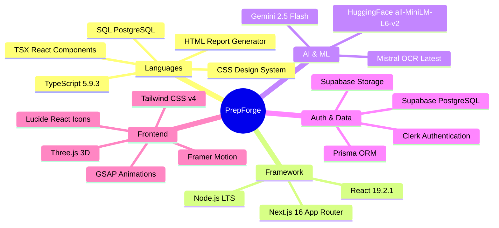

### Core Languages

| Language | Role |
|---|---|
| **TypeScript** (v5.9.3) | All application code — server, client, API routes, types |
| **TSX (TypeScript + JSX)** | React components and pages |
| **CSS** | Global styles (`globals.css`, 18 KB of premium design tokens) |
| **HTML** | Report generation — `reportGenerator.ts` outputs raw HTML for PDF printing |
| **SQL (PostgreSQL dialect)** | Database queries managed via Prisma ORM |

### Framework & Runtime

| Technology | Version | Purpose |
|---|---|---|
| **Next.js** | 16.0.10 | Full-stack React framework (App Router) |
| **React** | 19.2.1 | UI library |
| **Node.js** | LTS | Server runtime |
| **Webpack** | via Next.js | Bundler (`next dev --webpack`) |

### AI & ML Libraries

| Library | Purpose |
|---|---|
| `@google/generative-ai` ^0.24.1 | Gemini 2.5 Flash — grading, OCR fallback, embeddings, OMR vision |
| `@mistralai/mistralai` ^2.2.5 | Mistral OCR Latest — primary handwriting/PDF OCR |
| HuggingFace Inference API | `sentence-transformers/all-MiniLM-L6-v2` embeddings for RAG |

### Auth, Database & Storage

| Technology | Purpose |
|---|---|
| **Clerk** (`@clerk/nextjs ^7.4.3`) | Authentication & user management |
| **Prisma** (`^6.19.2`) | PostgreSQL ORM |
| **Supabase** (`@supabase/supabase-js ^2.90.1`) | File storage (answer sheets, rubrics) + PostgreSQL hosting |

### Frontend & Animation

| Library | Purpose |
|---|---|
| **GSAP** (`^3.15.0`) | Premium motion design — landing page animations |
| **Framer Motion** (`^12.40.0`) | Component-level transitions and micro-animations |
| **Three.js** (`^0.184.0`) | 3D canvas effects |
| **Lucide React** (`^0.561.0`) | Icon library |
| **Tailwind CSS** (`^4.1.18`) | Utility-first CSS framework |
| `class-variance-authority`, `clsx`, `tailwind-merge` | Class utility composition |

---

## 3. System Architecture

### High-Level Architecture

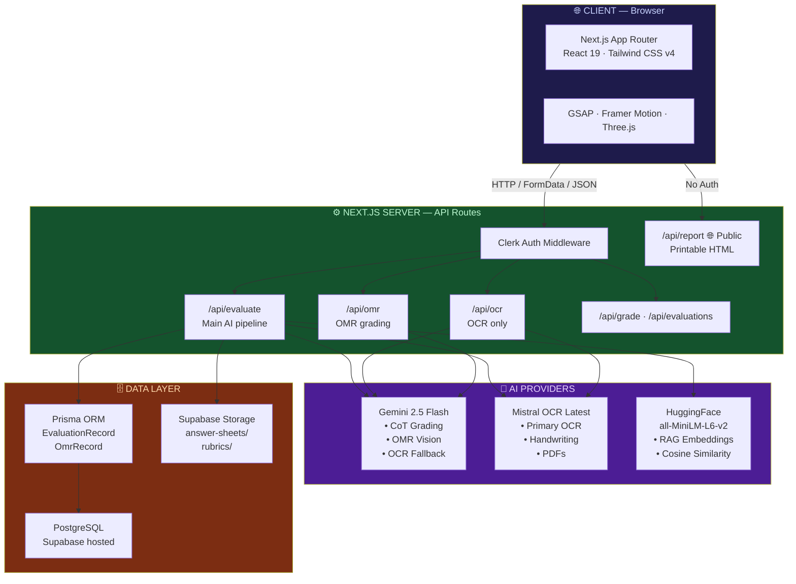

### Request Flow — Full Evaluation Pipeline

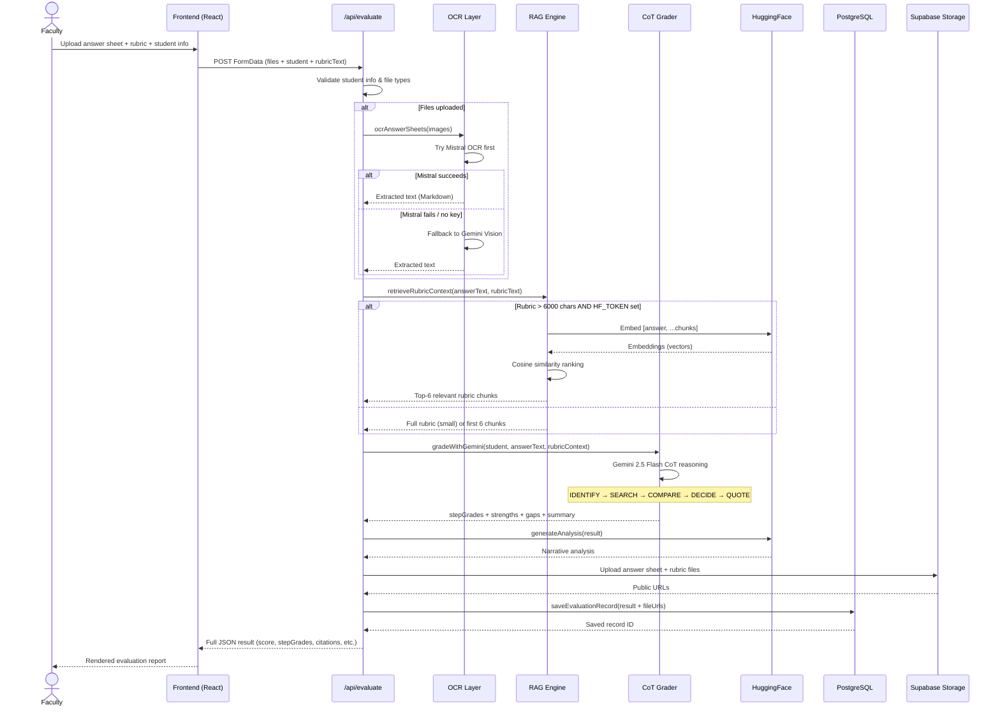

---

## 4. AI Implementation — Deep Dive

### 4.1 OCR — Multi-Provider Pipeline

**Files:** `app/lib/ai-grading.ts` · `app/lib/mistralOCR.ts`

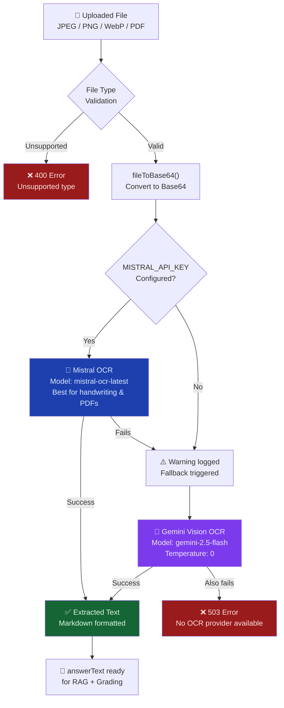

**Key design choices:**
- Mistral OCR is prioritized — specifically designed for handwriting, returns structured Markdown
- Gemini Vision is the universal fallback — handles JPEG, PNG, WebP, and PDF up to 12 MB
- File type validation runs before OCR (`isSupportedScanMimeType`)
- All images are converted to Base64 (`fileToBase64`) before AI providers receive them

---

### 4.2 OMR Vision — Bubble Sheet Reading

**File:** `app/lib/ai-grading.ts` — `ocrOmrSheet()`

```mermaid
flowchart LR
    IMG["📸 OMR Sheet\nImage / PDF"] --> GV["Gemini Vision\ngemini-2.5-flash\nStrict JSON Schema"]

    GV --> JSON["Structured JSON Response"]

    subgraph JSON["📦 Gemini JSON Response"]
        A["answers: A, B, -, ?, D ..."]
        B["anomalies: Q3 double bubble"]
        C["notes: readability comment"]
    end

    JSON --> SCORE["Scoring Engine\nevaluation.ts"]

    subgraph SCORE["🎯 OMR Scoring Rules"]
        S1["✅ Correct → +4 marks"]
        S2["❌ Wrong → -1 mark\nnegative marking"]
        S3["⬜ Blank → 0 marks"]
        S4["⚠️ Anomaly → 0 marks\nflagged for review"]
    end

    SCORE --> RESULT["OmrResult\nscore / total / accuracy\nsubjectWise breakdown"]

    style GV fill:#7c3aed,color:#ede9fe
    style RESULT fill:#166534,color:#dcfce7
```

**What Gemini returns for each OMR sheet:**
```typescript
{
  answers: ["A", "B", "-", "?", "D", ...],  // A/B/C/D, "-" blank, "?" ambiguous
  anomalies: ["Q3 double bubble", "Q7 faint mark"],
  notes: "Sheet is moderately legible; Q3 and Q7 need manual review."
}
```

---

### 4.3 Chain-of-Thought Grading (CoT)

**File:** `app/lib/ai-grading.ts` — `gradeWithGemini()`

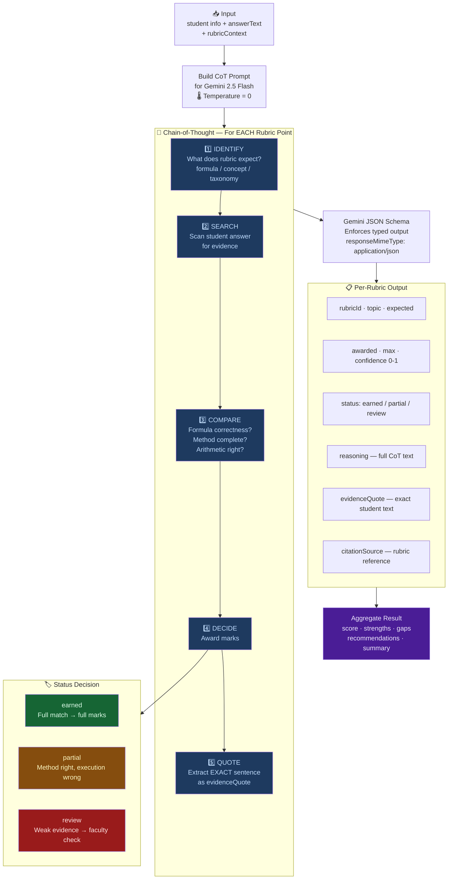

**Temperature = 0** — Deterministic, consistent grading across evaluations.

---

### 4.4 RAG — Retrieval-Augmented Generation

**File:** `app/lib/ai-grading.ts` — `retrieveRubricContext()` · `chunkRubric()`

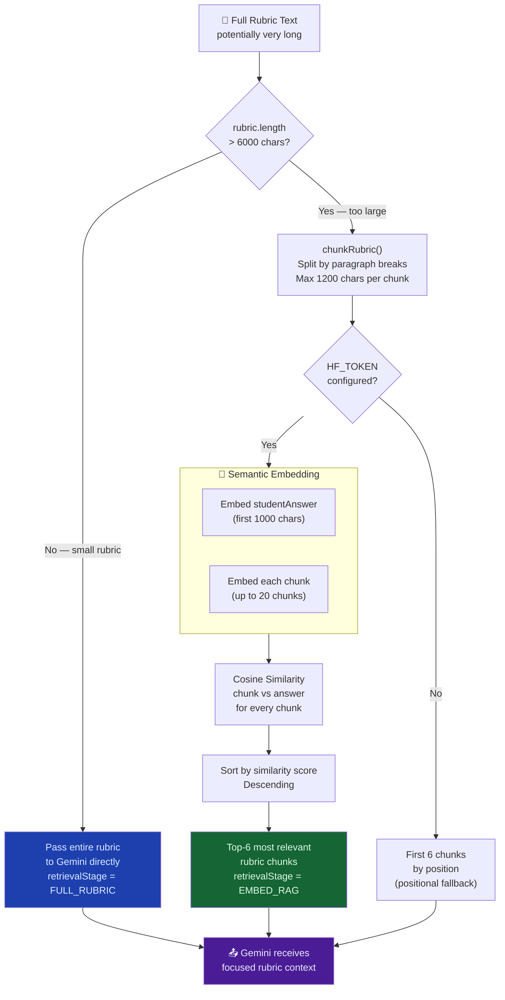

**Retrieval stage** is tracked in `retrievalTrace`:
- `"EMBED_RAG"` — semantic retrieval was used (HuggingFace available)
- `"FULL_RUBRIC"` — rubric small enough to pass entirely

---

### 4.5 Semantic Embeddings (HuggingFace)

**Files:** `app/lib/hfEmbeddings.ts` · `app/lib/hfAnalysis.ts`

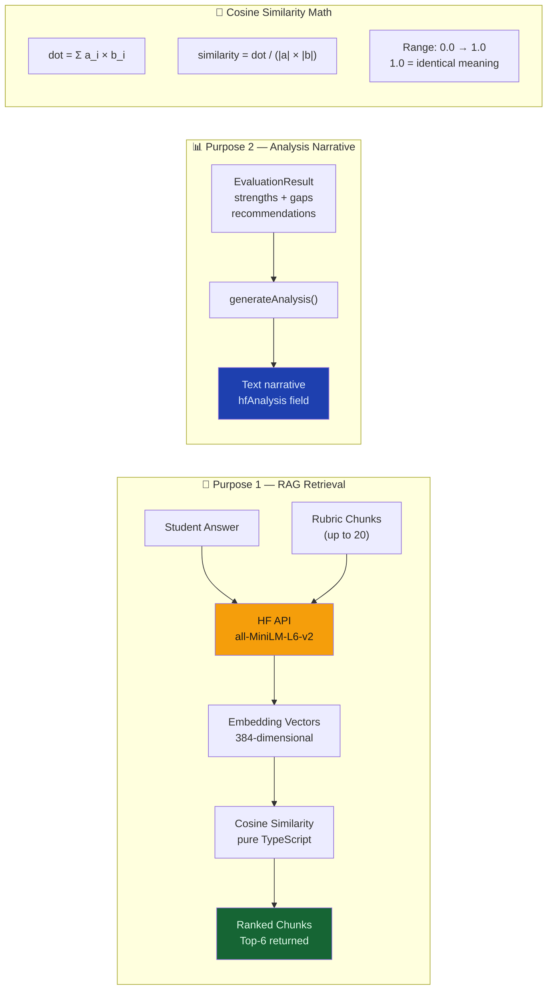

---

### 4.6 Local Fallback Engine

**File:** `app/lib/evaluation.ts` — `evaluateLocally()`

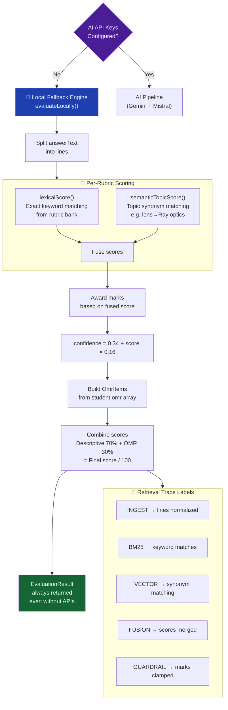

---

## 5. API Routes

### Route Map

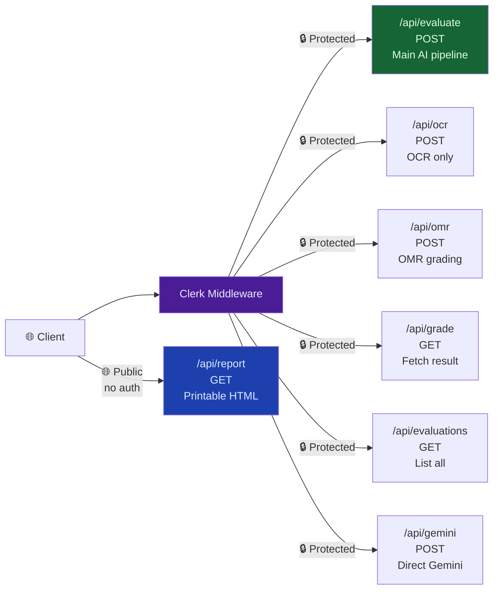

### `/api/evaluate` — Request Format (multipart/form-data)

| Field | Type | Description |
|---|---|---|
| `student` | JSON string | `{ name, roll, stream, subject, batch?, examType?, section? }` |
| `answerText` | string | Typed answer (optional if files uploaded) |
| `rubricText` | string | Marking rubric text |
| `answerFiles` | File[] | Handwritten sheets (JPEG/PNG/WebP/PDF, max 12MB each) |
| `criteriaFiles` | File[] | Rubric/criteria documents |

### `/api/evaluate` — Response Format

```typescript
{
  score: number,           // 0-100
  total: 100,
  confidence: number,      // 0.0-1.0
  stepGrades: StepGrade[], // Per-rubric-point breakdown
  citations: Citation[],   // Evidence quotes from student answer
  omr: {
    score, total,
    items: OmrItem[],      // Per-question result
    anomalies: string[]
  },
  strengths: string[],
  gaps: string[],
  recommendations: string[],
  retrievalTrace: { stage: string, detail: string }[],
  summary: string,
  hfAnalysis?: string,     // HuggingFace narrative (if available)
  savedId?: string,        // PostgreSQL record ID
  fileUrls?: string[],     // Supabase storage URLs
  warning?: string         // Present only if fallback was used
}
```

---

## 6. Database & Storage

### Database Schema

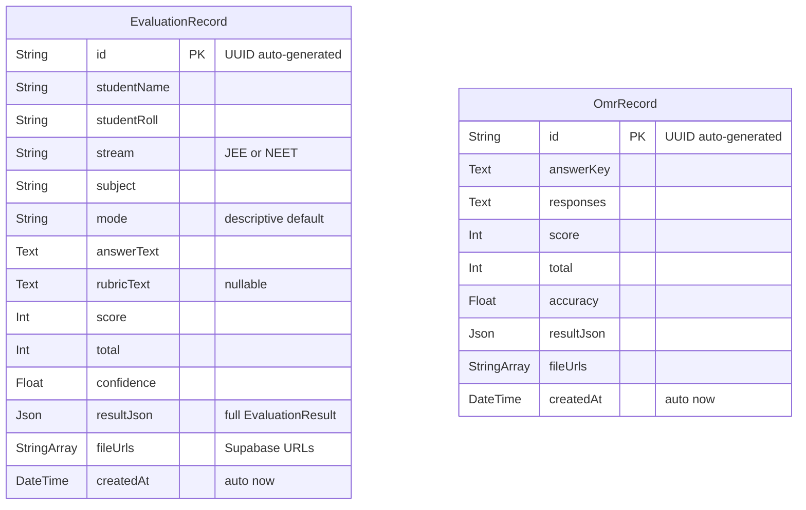

### Storage Architecture

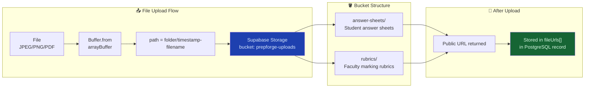

---

## 7. Authentication

### Clerk Auth Flow

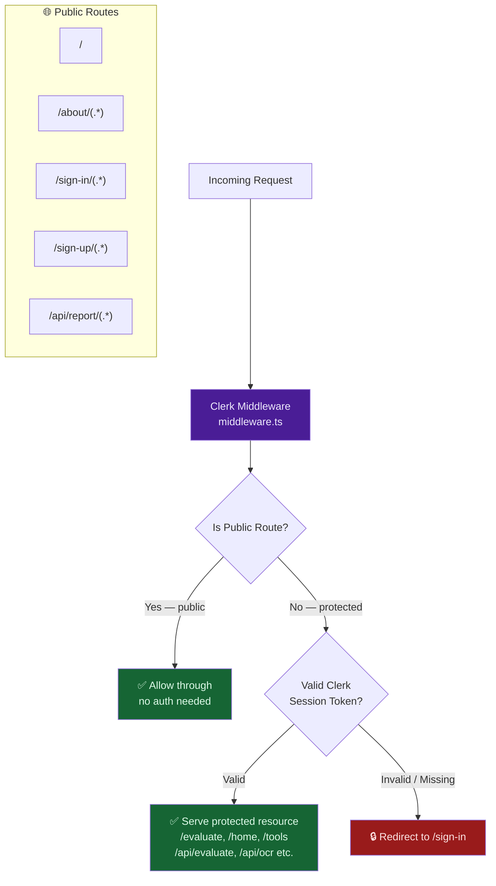

---

## 8. Frontend & Animations

### Page Structure

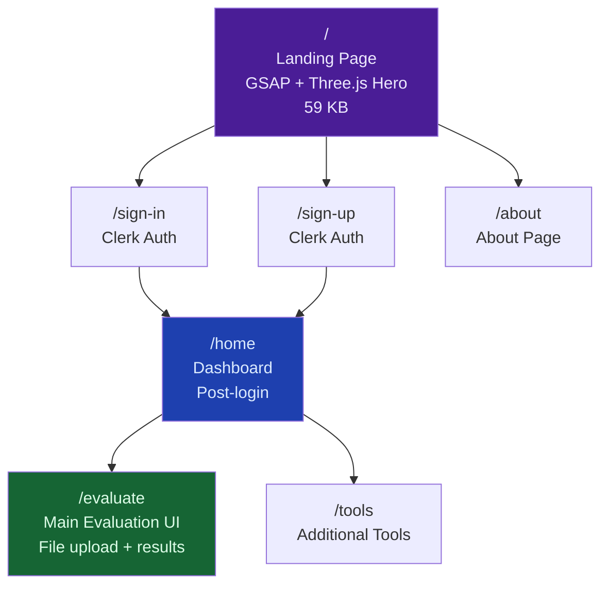

### Animation Stack

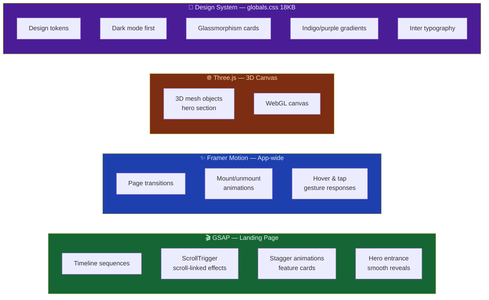

---

## 9. Important Highlights & Design Decisions

### Fallback Chain — System Never Fails

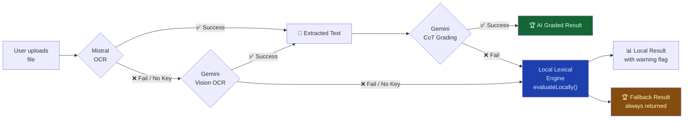

### Exponential Backoff + Timeout

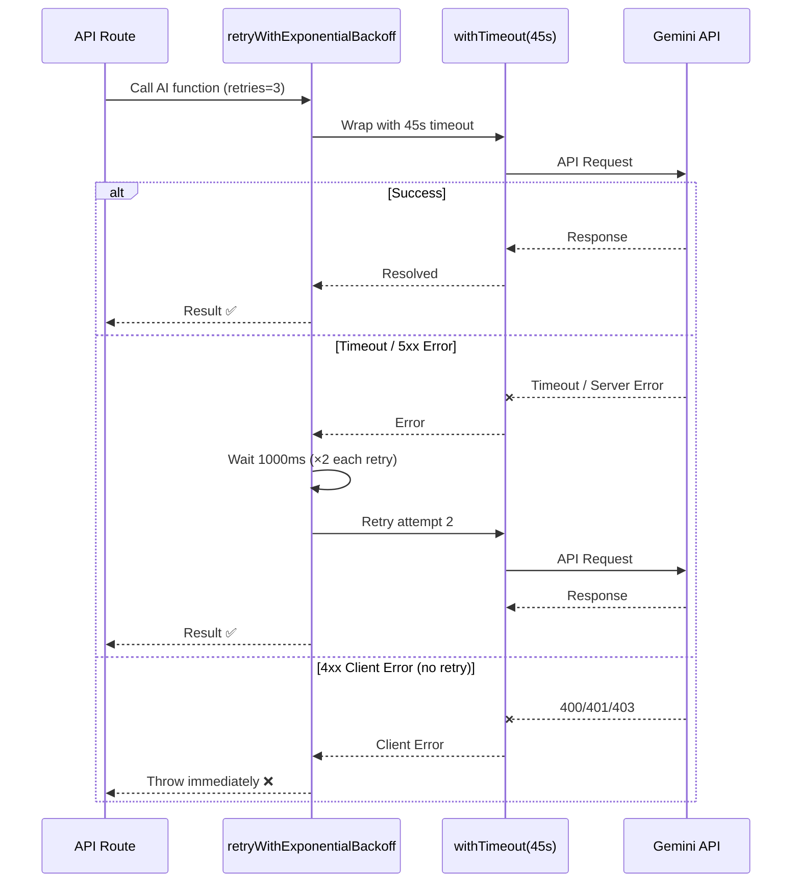

### Evidence-Backed Grading

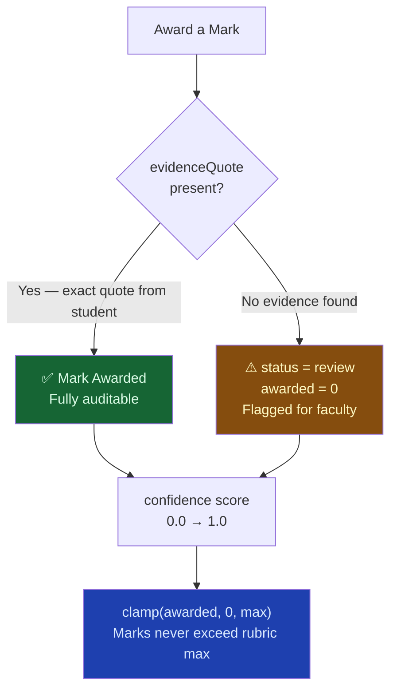

### TypeScript Type Safety

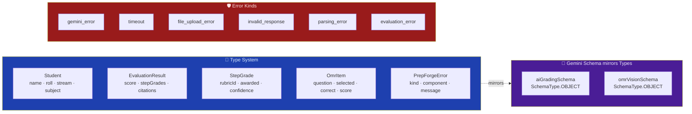

---

## 10. Environment Variables

```env
# AI Providers
GEMINI_API_KEY=              # Google Gemini (get at aistudio.google.com/apikey)
GEMINI_MODEL=gemini-2.5-flash   # Model override
GEMINI_TIMEOUT_MS=45000      # Request timeout in ms
MISTRAL_API_KEY=             # Mistral (console.mistral.ai) -- primary OCR
HF_TOKEN=                    # HuggingFace -- RAG embeddings + analysis

# Authentication (Clerk)
NEXT_PUBLIC_CLERK_PUBLISHABLE_KEY=
CLERK_SECRET_KEY=

# Database (Supabase PostgreSQL)
DATABASE_URL=                # Pooled connection URL (runtime)
DIRECT_URL=                  # Direct connection URL (migrations)

# Storage (Supabase)
NEXT_PUBLIC_SUPABASE_URL=
NEXT_PUBLIC_SUPABASE_PUBLISHABLE_KEY=
SUPABASE_SERVICE_ROLE_KEY=
```

### Minimum Config Required

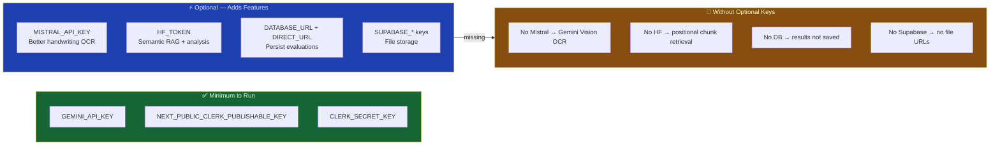

---

## 11. Project File Structure

```mermaid
graph TD
    ROOT["PrepForge/"]

    ROOT --> APP["app/"]
    ROOT --> PRISMA["prisma/schema.prisma\nDB models"]
    ROOT --> MW2["middleware.ts\nClerk auth"]
    ROOT --> PKG["package.json"]
    ROOT --> ENV[".env"]

    APP --> API["api/"]
    APP --> LIB["lib/"]
    APP --> COMP["components/"]
    APP --> PAGES["Pages"]
    APP --> CSS["globals.css\n18 KB design system"]
    APP --> LAY["layout.tsx\nClerk provider"]
    APP --> LAND["page.tsx\nLanding — 59 KB\nGSAP + Three.js"]

    API --> A1["evaluate/route.ts\nMain AI endpoint"]
    API --> A2["ocr/route.ts"]
    API --> A3["omr/route.ts"]
    API --> A4["grade/route.ts"]
    API --> A5["evaluations/route.ts"]
    API --> A6["report/route.ts\nPublic"]
    API --> A7["gemini/route.ts"]

    LIB --> L1["gemini.ts\nClient + retry + timeout"]
    LIB --> L2["mistralOCR.ts\nImages & PDFs"]
    LIB --> L3["hfEmbeddings.ts\nVectors + cosine sim"]
    LIB --> L4["hfAnalysis.ts\nNarrative generation"]
    LIB --> L5["ai-grading.ts\nFull AI pipeline"]
    LIB --> L6["evaluation.ts\nTypes + local fallback"]
    LIB --> L7["evaluation-store.ts\nPrisma CRUD"]
    LIB --> L8["reportGenerator.ts\nHTML report builder"]
    LIB --> L9["supabase.ts\nFile upload"]
    LIB --> L10["debug.ts\nPrepForgeError + utils"]

    PAGES --> PG1["evaluate/page.tsx"]
    PAGES --> PG2["home/page.tsx"]
    PAGES --> PG3["tools/page.tsx"]
    PAGES --> PG4["about/page.tsx"]
    PAGES --> PG5["sign-in/ sign-up/"]

    style A1 fill:#166534,color:#dcfce7
    style L5 fill:#4a1d96,color:#ede9fe
    style LAND fill:#7c2d12,color:#fed7aa
    style L1 fill:#1e40af,color:#dbeafe
```

---

## Summary

```mermaid
graph TB
    subgraph CORE["🏗️ Core Platform"]
        C1["Next.js 16 App Router\nFull-stack TypeScript"]
        C2["React 19 + Tailwind v4\nPremium UI"]
    end

    subgraph AI_SUM["🤖 AI Engine"]
        A1["Gemini 2.5 Flash\nCoT Grading + OMR Vision"]
        A2["Mistral OCR Latest\nHandwriting + PDFs"]
        A3["HuggingFace MiniLM\nSemantic RAG"]
    end

    subgraph DATA_SUM["🗄️ Data Layer"]
        D1["Clerk\nAuthentication"]
        D2["Supabase PostgreSQL\nPersistence"]
        D3["Supabase Storage\nFile Management"]
    end

    subgraph DESIGN["✨ Design Principles"]
        P1["Auditability\nevery mark has evidence quote"]
        P2["Reliability\nmulti-provider fallback chain"]
        P3["Academic Accuracy\nJEE/NEET-aware CoT + schemas"]
        P4["Always Functional\nlocal engine without APIs"]
    end

    CORE --> AI_SUM
    AI_SUM --> DATA_SUM
    CORE --> DESIGN

    style CORE fill:#1e3a5f,color:#bfdbfe
    style AI_SUM fill:#4a1d96,color:#ede9fe
    style DATA_SUM fill:#166534,color:#dcfce7
    style DESIGN fill:#7c2d12,color:#fed7aa
```

---

