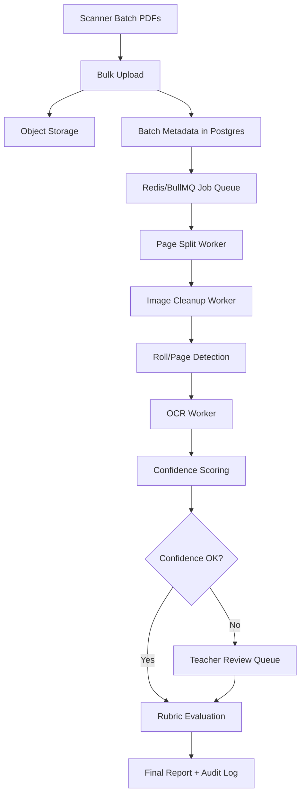

# PrepForge

PrepForge is an exam-answer evaluation system for coaching institutes and schools that need to process descriptive answer sheets, OMR sheets, rubric-based marks, and review workflows at class scale.

The important production problem is volume. A single subject for 200 students can easily become:

```text
200 students x 40 pages = 8,000 scanned pages
```

The system is designed around bulk processing, not manual one-by-one uploads. Teachers should not manage thousands of pages individually. They should create a batch, upload scanner exports, review only exceptions, and approve final results.

---

## Core Idea

PrepForge has two evaluation paths:

1. **Individual evaluation console**
   - Useful for testing, demos, single-student evaluation, OMR checks, and report generation.
   - Route: `/evaluate`

2. **Bulk evaluation console**
   - Built for real class-scale processing.
   - One batch represents one exam, one subject, and one group of students.
   - Teachers upload scanner PDFs/images/ZIP exports in bulk.
   - The system counts pages, tracks processing stages, identifies review load, and prevents unclear handwriting from being auto-scored.
   - Route: `/bulk-evaluation`

The key fairness principle is simple:

> OCR is evidence, not the final source of truth when handwriting is unclear.

If the system is not confident, the answer goes to human review instead of silently lowering the student's score.

---

## Practical Bulk Workflow

### 1. Physical Scanning

Teachers or admin staff scan answer sheets using a copier/scanner with an automatic document feeder.

Recommended scan settings:

```text
Resolution: 300 DPI
Mode: grayscale or black-and-white
Format: PDF
Batch style: one PDF per class, subject, bundle, or roll-number range
```

Teachers do not upload 8,000 files. They upload a small number of scanner outputs, for example:

```text
physics-class12-roll-001-050.pdf
physics-class12-roll-051-100.pdf
physics-class12-roll-101-150.pdf
physics-class12-roll-151-200.pdf
```

### 2. Batch Creation

In `/bulk-evaluation`, the admin enters:

- Batch title
- Exam name
- Subject
- Expected student count
- Expected pages per student
- Scanner batch files

For example:

```text
Subject: Physics
Students: 200
Pages each: 40
Expected pages: 8,000
```

### 3. Page Accounting

The backend uses `pdf-lib` to count PDF pages. Image files are counted as single pages.

The system compares:

- Expected pages
- Detected pages
- Missing/unmatched pages
- Estimated low-confidence review count

This catches operational mistakes early, such as:

- Missing bundles
- Duplicate uploads
- Wrong subject upload
- Incomplete scan
- Cropped or unreadable pages

### 4. Processing Gates

The bulk console tracks the batch through practical gates:

- Bulk intake
- Page splitting
- Student matching
- OCR confidence gate
- Human review

This is intentionally simple. Teachers should see where the batch is stuck without understanding internal OCR or queue systems.

### 5. Low-Confidence Review

The system creates review items when a page or answer span is risky.

Examples:

- Low handwriting confidence
- OCR and visual evidence disagree
- Missing page
- Cropped answer
- Unmatched roll number
- Borderline rubric match
- High-mark question with uncertain text

Teachers review only these flagged items, not every page.

### 6. Finalization

Final marks should be published only after:

- Required low-confidence items are approved or corrected
- Missing/unmatched pages are resolved
- Sampling checks pass
- Audit logs exist for manual overrides

---

## What Was Implemented

### Bulk Evaluation Page

File:

```text
app/bulk-evaluation/page.tsx
```

This page provides the teacher/admin UI for bulk processing.

It includes:

- Batch setup form
- Expected page calculation
- Scanner batch upload
- Recent batches list
- Processing gate dashboard
- Low-confidence review queue
- Approve/correct actions
- External tool/key explanation

This page is linked from the navbar as:

```text
Bulk Console
```

### Bulk Batch API

File:

```text
app/api/bulk-batches/route.ts
```

Supported methods:

```text
GET    /api/bulk-batches
POST   /api/bulk-batches
PATCH  /api/bulk-batches
```

Responsibilities:

- List recent bulk batches
- Create a new batch from uploaded scanner files
- Update review item status

### Bulk Evaluation Store

File:

```text
app/lib/bulk-evaluation-store.ts
```

Responsibilities:

- Count uploaded PDF pages with `pdf-lib`
- Summarize uploaded files
- Estimate detected pages
- Estimate review load
- Build processing stages
- Build review queue items
- Track optional OCR/AI keys
- Persist development data locally

Local development persistence path:

```text
prisma/bulk_batches.json
```

This keeps the implementation usable without requiring a database migration immediately.

### Environment Documentation

File:

```text
.env.example
```

Added:

```env
MISTRAL_API_KEY=your_mistral_api_key_optional
```

This is optional. The bulk workflow does not require it.

---

## File System and Storage Design

### Current Development Mode

The current implementation stores bulk batch metadata in:

```text
prisma/bulk_batches.json
```

This stores:

- Batch id
- Exam metadata
- Expected page count
- Detected page count
- Uploaded file summaries
- Processing stages
- Review items
- Optional key status
- Notes
- Created timestamp

This is enough for local development and demos.

### Production Storage Design

For production, files should not be stored in JSON or directly inside the app directory.

Use this structure:

```text
object-storage/
  institutions/{institutionId}/
    exams/{examId}/
      subjects/{subjectId}/
        batches/{batchId}/
          originals/
            scanner-upload-001.pdf
            scanner-upload-002.pdf
          pages/
            page-000001.png
            page-000002.png
          thumbnails/
            page-000001.webp
          ocr/
            page-000001.json
          reviews/
            review-item-001.json
          reports/
            final-report.pdf
```

Recommended production storage:

- **Supabase Storage** if you already use Supabase
- **MinIO** for free self-hosted S3-compatible storage
- **AWS S3 / Cloudflare R2** if you want managed object storage

Recommended metadata database:

- PostgreSQL
- Prisma ORM

Recommended queue:

- Redis
- BullMQ

### Why Separate Files and Metadata?

Large scans should live in object storage. Database rows should store metadata and references only.

Good database records:

```text
batchId
studentId
subjectId
pageNumber
objectStorageKey
ocrConfidence
reviewStatus
finalScore
auditLogId
```

Bad database records:

```text
raw PDF binary
full page image binary
huge OCR blobs mixed with student rows
```

Keeping files separate makes the system cheaper, faster, and easier to back up.

---

## OCR Strategy

OCR should be layered.

### Free/Open-Source First

Use free tools before paid APIs:

- **PDF page extraction:** PDF.js or Poppler
- **Image cleanup:** OpenCV
- **Printed OCR:** Tesseract
- **Queue workers:** BullMQ + Redis
- **Object storage:** MinIO or Supabase Storage

This is enough for:

- Page counting
- Printed roll numbers
- Page labels
- OMR-like regions
- Basic scan quality checks
- Routing pages to review

### Optional OCR API Fallback

External OCR or vision APIs are useful for hard handwriting, but they should not be mandatory for fairness.

Optional keys:

```env
MISTRAL_API_KEY=...
GEMINI_API_KEY=...
```

Use them only for:

- Hard handwriting
- Cropped or noisy pages
- High-mark questions
- Pages where local OCR confidence is low
- Reducing manual review workload

### Required External APIs?

For the new bulk workflow:

```text
No external API key is required.
```

The system can run in local-only mode and route uncertain handwriting to review.

For automatic AI grading:

```text
GEMINI_API_KEY is needed for Gemini-based grading already used elsewhere in the app.
```

For Mistral OCR:

```text
MISTRAL_API_KEY is optional and only needed if you want Mistral OCR fallback.
```

For Hugging Face:

```text
HF_TOKEN may be needed by existing Hugging Face embedding/analysis code, depending on deployment and API access.
```

---

## Fairness Design

OCR can favor neat handwriting. PrepForge must avoid turning handwriting neatness into marks.

Fairness rules:

1. Do not auto-score unclear handwriting with high confidence.
2. Track confidence per page, question, and answer span.
3. Send low-confidence answers to human review.
4. Preserve the original scanned page as evidence.
5. Let teachers override OCR text and marks.
6. Store every override with timestamp and reason.
7. Do not reduce marks only because OCR failed.
8. Sample-check high-confidence results to detect systematic bias.

### Confidence Gates

Suggested thresholds:

```text
>= 85% confidence: eligible for auto-processing
70-84% confidence: process, but sample-check
50-69% confidence: review required for important answers
< 50% confidence: manual review required
```

The thresholds should be tuned with real scanned papers before production use.

### Audit Logs

Every final score should be explainable.

Store:

- Original scan reference
- OCR text
- OCR confidence
- Rubric point matched
- Suggested mark
- Final mark
- Reviewer id
- Override reason
- Timestamp

This makes the result defensible if a student or parent challenges it.

---

## Processing Architecture

Recommended production architecture:



### Why Queue Workers?

8,000 pages should not be processed inside a normal web request.

Use background workers because:

- Processing may take minutes or hours
- Failed pages can retry
- Multiple workers can run in parallel
- The UI can show progress
- The server does not timeout

### Suggested Worker Jobs

```text
batch.created
pdf.split
page.cleaned
page.roll_detected
page.ocr_completed
answer.segmented
answer.scored
review.required
review.completed
report.generated
```

---

## Existing Evaluation System

The project also includes an individual evaluation console.

Important files:

```text
app/evaluate/page.tsx
app/api/evaluate/route.ts
app/api/ocr/route.ts
app/api/omr/route.ts
app/api/report/route.ts
app/lib/evaluation.ts
app/lib/ai-grading.ts
app/lib/gemini.ts
app/lib/mistralOCR.ts
app/lib/hfEmbeddings.ts
app/lib/hfAnalysis.ts
app/lib/evaluation-store.ts
```

This path handles:

- Descriptive answer evaluation
- OMR scoring
- OCR calls
- Rubric-based grading
- Report generation
- Evaluation history

The bulk system is complementary. It should eventually feed grouped answer text and review-confirmed spans into the same grading/reporting logic.

---

## Recommended Next Implementation Steps

1. Replace local JSON bulk storage with Prisma models:
   - `BulkBatch`
   - `BulkFile`
   - `BulkPage`
   - `BulkReviewItem`
   - `BulkAuditLog`

2. Add object storage:
   - Supabase Storage or MinIO
   - Save originals, page images, thumbnails, OCR JSON, and reports

3. Add worker queue:
   - Redis
   - BullMQ
   - Separate page processing from Next.js request handlers

4. Add real page splitting:
   - PDF.js or Poppler
   - Store page images individually

5. Add scan-quality checks:
   - Blur detection
   - Skew detection
   - Crop detection
   - Contrast detection

6. Add roll/page matching:
   - Printed QR/barcode if possible
   - Printed roll number OCR fallback
   - Manual exception screen

7. Add real OCR confidence scoring:
   - Local OCR first
   - Optional Mistral/Gemini fallback
   - Human review for low confidence

8. Connect final reviewed answers to grading:
   - Use existing rubric grading
   - Store citations and score evidence
   - Generate final reports

---

## Development Setup

Install dependencies:

```bash
npm install
```

Copy environment file:

```bash
cp .env.example .env
```

Start development server:

```bash
npm run dev
```

Useful routes:

```text
/                  Landing page
/evaluate          Individual evaluation console
/bulk-evaluation  Bulk scanner batch workflow
/architecture      System blueprint page
/handwriting-fairness  Handwriting fairness dashboard
```

---

## Current Verification Notes

Targeted lint passes for the new bulk implementation files:

```bash
npx.cmd eslint app/bulk-evaluation/page.tsx app/api/bulk-batches/route.ts app/lib/bulk-evaluation-store.ts app/components/Navbar.tsx
```

Full project lint/build currently has existing unrelated failures in handwriting fairness files and a `Jimp` import issue. Those should be fixed separately before production deployment.

---

## License

This project is proprietary. All rights reserved.
