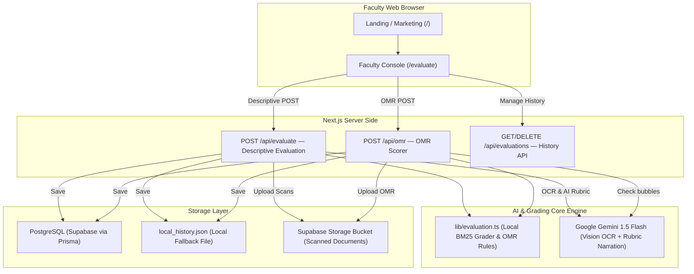
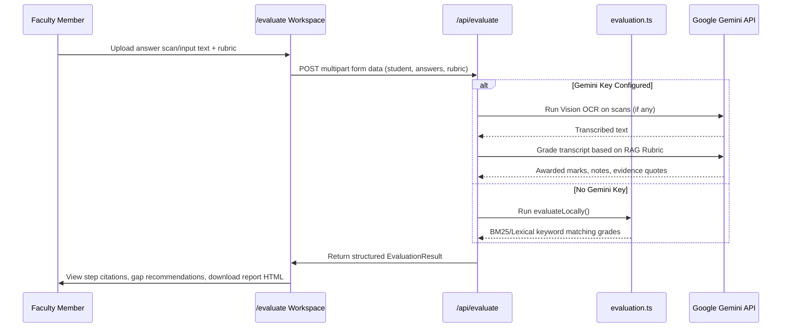

# PrepForge — Faculty AI Evaluation Suite for JEE & NEET

PrepForge is a professional, production-oriented AI grading suite designed for faculty to evaluate step-wise descriptive answers, audit OMR answer keys, track learning gaps, and export printable student performance reports.

PrepForge has been streamlined down to its core product offering — the **Faculty Console** — which runs in both **Local Demo Mode** (using a local JSON filesystem fallback) and **Production Database Mode** (using PostgreSQL via Prisma ORM) with optional Google Gemini vision OCR and AI evaluation.

---

## Table of Contents

- [Overview & Use Cases](#overview--use-cases)
- [System Architecture](#system-architecture)
- [Evaluation Workflow & Pipelines](#evaluation-workflow--pipelines)
- [Core Features](#core-features)
- [Evaluation History & Storage](#evaluation-history--storage)
- [Setup & Installation](#setup--installation)
- [Usage Examples](#usage-examples)
- [Project Directory Structure](#project-directory-structure)

---

## Overview & Use Cases

Faculty members grading papers for competitive exams like **JEE (Joint Entrance Examination)** and **NEET (National Eligibility cum Entrance Test)** face two primary challenges:
1. **Descriptive Step Grading:** Awarding marks for steps, methods, formulas, and units in accordance with strict marking rubrics (e.g., NCERT standards).
2. **OMR Sheet Verification:** Reviewing multiple-choice questions, detecting double-bubbling anomalies or light marks, and compiling rankings.

PrepForge automates both of these flows from a single workspace, giving faculty immediate evaluations that link every awarded mark back to specific lines of student text or marking rubrics (using a lexical/semantic citation system).

---

## System Architecture



---

## Evaluation Workflow & Pipelines

### 1. Step-Wise Descriptive Answer Grading
The descriptive evaluation pipeline operates on a hybrid model. If a `GEMINI_API_KEY` is provided, a fully customized LLM prompt generates step-by-step audit reports. If no key is present, the suite falls back to a deterministic local keyword/topic similarity engine to preserve local grading functionality.



### 2. OMR Audit Pipeline
Checks multiple-choice options against an answer key. Anomalies (e.g. invalid options or multiple responses per question) are automatically highlighted.

---

## Core Features

- **Evidence-Backed Citation Badges:** Every step-wise mark awarded lists the exact source rubric reference and the line number of the student's answer sheet where the evidence was found.
- **NCERT Gap Analysis:** Students' weak areas are mapped back to targeted NCERT recommendations (e.g. *"Revise NCERT sign convention for Ray Optics and solve 12 PYQs"*).
- **Vision OCR Integration:** Upload handwritten student paper scans directly. PrepForge transcribes them, highlights lines, and grades them.
- **Exportable HTML Reports:** Save grading summaries locally as print-ready, clean HTML cards showing score, OMR accuracy, strengths, weaknesses, and subject graphs.
- **Evaluation History panel:** Access, reload, or delete past OMR checks and descriptive reports.

---

## Evaluation History & Storage

PrepForge features a transparent, database-less fallback architecture for saving evaluation history:

1. **Database Mode (Production):**
   If `DATABASE_URL` is configured in your `.env` file, PrepForge saves evaluations directly to a Supabase PostgreSQL database using the `EvaluationRecord` and `OmrRecord` Prisma models.
2. **Local Fallback Mode (Development/Demo):**
   If no `DATABASE_URL` is found, PrepForge writes and reads history logs to a local JSON file at `prisma/local_history.json`.

### Schema Details

```prisma
model EvaluationRecord {
  id          String   @id @default(uuid())
  studentName String
  studentRoll String
  stream      String   // "JEE" or "NEET"
  subject     String
  mode        String   @default("descriptive")
  answerText  String   @db.Text
  rubricText  String?  @db.Text
  score       Int
  total       Int
  confidence  Float
  resultJson  Json     // Full EvaluationResult payload
  fileUrls    String[] // Cloud file links
  createdAt   DateTime @default(now())
}

model OmrRecord {
  id         String   @id @default(uuid())
  answerKey  String   @db.Text
  responses  String   @db.Text
  score      Int
  total      Int
  accuracy   Float
  resultJson Json     // Full OMR audit payload
  fileUrls   String[]
  createdAt  DateTime @default(now())
}
```

---

## Setup & Installation

### Prerequisites
- Node.js (v18 or above recommended)
- A Google Gemini API Key (free from [Google AI Studio](https://aistudio.google.com/apikey))

### 1. Clone & Install
```bash
git clone https://github.com/DevSars24/PrepForge.git
cd PrepForge
```

### 2. Run Automatic Setup
Double-click `setup.bat` (Windows) or execute:
```bash
npm install
npx prisma generate
```
*(This sets up your project dependencies and generates the Prisma client. It will also try to sync Supabase tables if a database URL is present).*

### 3. Configure Environment Variables
Create a `.env` file in the root folder (or copy `.env.example`):
```env
# Required for Gemini AI grading & OCR
GEMINI_API_KEY=your_gemini_api_key

# Optional (Supabase Storage + DB logs)
DATABASE_URL=your_postgresql_pooler_url
DIRECT_URL=your_postgresql_direct_url
NEXT_PUBLIC_SUPABASE_URL=https://your-project.supabase.co
NEXT_PUBLIC_SUPABASE_PUBLISHABLE_KEY=your-supabase-key
```

### 4. Start Development Server
Double-click `dev.bat` (Windows) or run:
```bash
npm run dev
```
Open [http://localhost:3000/evaluate](http://localhost:3000/evaluate) to access the Faculty Console.

---

## Usage Examples

### 1. Step Marking Descriptive Rubric Example

**Rubric Input:**
```
PHY-OPT-01: Uses the mirror/lens formula with the correct sign convention. (Marks: 4)
Keywords: mirror formula, lens formula, sign convention
```

**Student Answer Input:**
```
Line 1: I used the lens formula: 1/f = 1/v - 1/u.
Line 2: I applied the standard Cartesian sign convention where object distance is negative.
```

**AI Result Output:**
```json
{
  "score": 4,
  "max": 4,
  "status": "earned",
  "note": "Lens formula and Cartesian sign convention correctly applied.",
  "evidenceQuote": "I used the lens formula: 1/f = 1/v - 1/u. I applied the standard Cartesian sign convention...",
  "citationSource": "PHY-OPT-01"
}
```

### 2. OMR Grading Format

**OMR Answer Key:**
```
A B C D B A C D A B
```

**Student Response Sheet:**
```
A B C D - A B D A C
```
- Q5 (`-`): Scored `0` (Blank)
- Q7 (`B` instead of `C`): Scored `-1` (Incorrect)
- Q1-4, 6, 8-9: Scored `+4` (Correct)

---

## Project Directory Structure

```
PrepForge/
├── app/                      # Next.js App Router root
│   ├── api/                  # Server-side API endpoints
│   │   ├── evaluate/         # Descriptive grading API
│   │   ├── evaluations/      # History listing and management API
│   │   ├── gemini/           # Core AI prompt helper API
│   │   ├── grade/            # Standalone API grader
│   │   ├── ocr/              # File transcription service
│   │   └── omr/              # OMR scanner API
│   ├── components/           # Reusable frontend React elements
│   │   └── ui/               # Primitive button and form styles
│   ├── evaluate/             # ★ Main Faculty Workspace Page
│   ├── lib/                  # Library files (Gemini, Prisma, local algorithms)
│   │   ├── ai-grading.ts     # Gemini prompts for grading & OMR
│   │   ├── evaluation-store.ts # History local file & database sync
│   │   ├── evaluation.ts     # Core models & offline math grading logic
│   │   ├── gemini.ts         # Google Generative AI SDK client
│   │   ├── prisma.ts         # Prisma client singleton
│   │   └── supabase.ts       # Supabase Cloud Storage client
│   ├── layout.tsx            # Global HTML wrappers & fonts
│   └── page.tsx              # Marketing product page
├── prisma/                   # Database configurations
│   ├── schema.prisma         # PostgreSQL schema definition
│   └── local_history.json    # File history storage (fallback)
├── public/                   # Shared image/logo assets
├── next.config.ts            # Next.js bundler settings
├── components.json           # Shadcn/ui configurations
├── setup.bat                 # Automatic Windows package installation
├── dev.bat                   # Live development starter script
└── package.json              # Active project packages
```

---

## License
Licensed under the MIT License.
